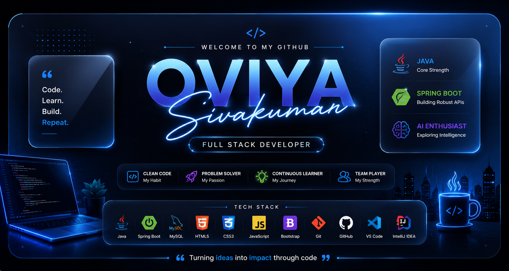

  

  

<h1 align="center">Hi 👋, I'm Oviya Sivakumar</h1>
<h3 align="center">🚀 Final Year Computer Science Engineering Student from India 🇮🇳</h3>

---

## 👩‍💻 About Me

🎓 Final Year BE CSE Student

💻 Learning Java Full Stack Development

🌱 Currently learning Spring Boot

🗄️ Database : MySQL

🤖 Interested in AI, Backend Development & Problem Solving

📫 Email : **skovi1110@gmail.com**

💼 LinkedIn :
https://www.linkedin.com/in/oviya-sivakumar-1405b13

---

## 📊 GitHub Stats

---

## 🛠️ Tech Stack

---

## 📈 Profile Views

---

## 💡 Quote

> *"Code. Learn. Build. Repeat."* 🚀
